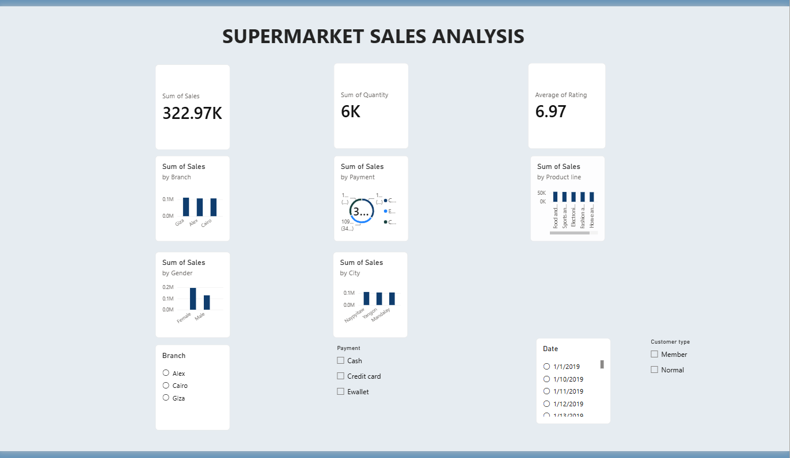

# Supermarket Sales Analysis & Interactive Business Intelligence Dashboard

## Overview
A portfolio-ready data analytics and Power BI project that analyzes supermarket transactions to uncover revenue, profitability, customer, product, branch, payment and time-based business insights.

## Business Problem
Management needs a clear view of sales performance across branches, product lines and customer segments to improve inventory, promotions, staffing and customer retention.

## Dataset
The project uses the provided `SuperMarket Analysis.csv` dataset.

- Rows: 1,000
- Columns: 17
- Date range: 2019-01-01 to 2019-03-30
- Missing values: 0
- Duplicate rows: 0

## Key Results
- Total Revenue: **322,966.75**
- Total Gross Income: **15,379.37**
- Total Transactions: **1,000**
- Total Quantity Sold: **5,510**
- Average Transaction Value: **322.97**
- Gross Profit Margin: **4.76%**
- Top Branch: **Giza**
- Top Product Line: **Food and beverages**
- Largest Customer Segment: **Member**
- Most Used Payment Method: **Ewallet**
- Peak Sales Hour: **19:00**

## Technology Stack
Python, Pandas, NumPy, Matplotlib, Seaborn, MySQL and Power BI.

## Project Structure
```text
Supermarket-Sales-Analysis/
├── data/
├── python/
├── sql/
├── powerbi/
├── outputs/
├── README.md
└── requirements.txt
```

## Workflow
1. Load the source CSV.
2. Inspect data quality.
3. Clean and enrich date/time fields.
4. Perform exploratory analysis.
5. Generate charts and business insights.
6. Run SQL KPI and segmentation queries.
7. Build the interactive Power BI dashboard.

## How to Run
```bash
pip install -r requirements.txt
python python/data_cleaning.py
python python/eda_analysis.py
python python/business_insights.py
```

## Portfolio Skills Demonstrated
- Data cleaning
- Exploratory Data Analysis
- KPI development
- SQL aggregation and segmentation
- Business intelligence
- Power BI dashboard design
- DAX
- Business storytelling
- Data-driven recommendations
- ## 📊 Power BI Dashboard


## 💡 Key Insights

- Identified the highest-performing product categories based on total sales and revenue.
- Compared branch-wise sales performance to identify stronger-performing locations.
- Analyzed customer types to understand purchasing behavior and transaction patterns.
- Identified the most commonly used payment methods among customers.
- Analyzed sales trends to understand changes in revenue and transaction volume.
- Evaluated product and category performance to identify major contributors to overall revenue.
- Used SQL and Python analysis to transform raw sales data into meaningful business insights.

## 📌 Conclusion

The Supermarket Sales Analysis project demonstrates an end-to-end data analytics workflow using **MySQL, Python, and Power BI**.

SQL was used to perform business-focused data analysis, Python was used for data cleaning, exploratory analysis, and visualization, and Power BI was used to build an interactive dashboard.

The analysis provides insights into **sales performance, customer behavior, product categories, branches, and payment methods**, helping businesses make data-driven decisions related to sales, inventory, and marketing strategies.
